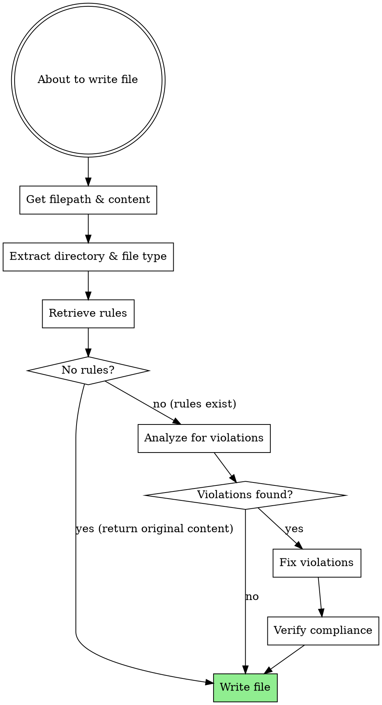

# Enforcing File Writing Rules

## Overview

**MANDATORY: This skill MUST be invoked before every Write or Edit tool call.**

Before writing ANY file to disk, check and enforce applicable rules. This ensures all written code automatically follows project standards without manual review.

**Key Principle:** Prevention > Detection. Fix violations before writing, not after.

**If no rules exist for the file:** Return the original content unchanged and proceed with writing.

## When to Use

**ALWAYS use before:**
- Writing new files
- Editing existing files
- Planning code changes (to know what rules apply)
- Code reviews (to verify compliance)

**Trigger phrases:**
- "I'm going to write..."
- "Let me create..."
- "I'll update this file..."
- "Here's the code..."

### When NOT to Use

- Reading files (no writing happening)
- Exploring codebase (no changes planned)
- User explicitly requests rule-free writing (rare)

## Quick Decision Guide

| Action | Check Rules? |
|--------|--------------|
| About to call Write/Edit tool | ✅ YES |
| Planning code implementation | ✅ YES |
| Showing example code | ✅ YES (if will be written) |
| Just reading/exploring | ❌ NO |
| User says "ignore rules for now" | ❌ NO |

## Core Workflow



## Implementation

### Step 1: Retrieve Applicable Rules

For filepath `src/api/users.ts`:

```bash
# Extract directory and file type
FILEPATH="src/api/users.ts"
DIR=$(dirname "$FILEPATH")  # "src/api"
FILE_TYPE="${FILEPATH##*.}"  # "ts"

# Get rules
node ${CLAUDE_PLUGIN_ROOT}/skills/enforcing-file-writing-rules/rules-engine.js \
  get-rules --pathname "$DIR" --file-types "typescript"
```

**Returns:** JSON array of applicable rules in precedence order (root → deepest)

**If no rules returned (empty array):** Return original file content unchanged and proceed with writing.

### Step 2: Analyze Code for Violations

**Only if rules exist.** If no rules were found in Step 1, skip to writing with original content.

For each rule, check if code complies:

**Example Rule:** "All async functions must include try-catch error handling"

**Violation Detection:**
```typescript
// ❌ VIOLATION
async function fetchUser(id: string) {
  const response = await fetch(`/api/users/${id}`);
  return response.json();
}

// ✅ COMPLIANT
async function fetchUser(id: string) {
  try {
    const response = await fetch(`/api/users/${id}`);
    return response.json();
  } catch (error) {
    console.error('Failed to fetch user:', error);
    throw error;
  }
}
```

### Step 3: Fix Violations Automatically

**Pattern 1: Add Missing Error Handling**

Rule: "All async functions must include try-catch"

```typescript
// BEFORE
async function saveData(data) {
  await api.save(data);
  return true;
}

// AFTER (automatic fix)
async function saveData(data) {
  try {
    await api.save(data);
    return true;
  } catch (error) {
    console.error('Failed to save data:', error);
    throw error;
  }
}
```

**Pattern 2: Add Missing Type Definitions**

Rule: "All function parameters must have type annotations"

```typescript
// BEFORE
function calculateTotal(items, tax) {
  return items.reduce((sum, item) => sum + item.price, 0) * (1 + tax);
}

// AFTER (automatic fix)
function calculateTotal(items: Item[], tax: number): number {
  return items.reduce((sum, item) => sum + item.price, 0) * (1 + tax);
}
```

**Pattern 3: Fix Naming Conventions**

Rule: "Component files must use PascalCase"

```typescript
// BEFORE: src/components/userProfile.tsx
export function userProfile() { ... }

// AFTER: src/components/UserProfile.tsx
export function UserProfile() { ... }
```

### Step 4: Verify and Write

After fixing violations:
1. Re-check all rules to ensure compliance
2. If compliant, proceed with writing
3. If still violations, fix and verify again

## Common Violation Patterns

| Rule Type | Detection | Fix |
|-----------|-----------|-----|
| Error handling | Missing try-catch around async | Wrap async operations |
| Type safety | Missing type annotations | Add TypeScript types |
| Naming | camelCase vs PascalCase | Rename according to convention |
| Imports | Relative vs absolute paths | Convert to project standard |
| Exports | Default vs named | Change export style |
| Documentation | Missing JSDoc | Add function/class documentation |

## Interaction Pattern

```
You: "Let me write this API handler..."

[Internal process - not shown to user:]
1. Extract filepath: src/api/auth.ts
2. Get rules for src/api/ with TypeScript
3. Check content against 3 applicable rules
4. Found violation: missing error handling
5. Fix: wrap in try-catch
6. Verify: all rules satisfied

You: "I've implemented the auth handler following the project's API conventions:
- Added try-catch error handling (required for src/api/)
- Used TypeScript strict types (required for src/)
- Included proper logging (required at root level)

[Shows corrected code to user]"
```

## Important Guidelines

### Always Check Before Writing

**Even if:**
- File is small
- "Just a quick fix"
- Under time pressure
- Rules seem obvious

**Checking takes seconds. Violations cause review delays.**

### Handle Multiple Rules

Rules apply hierarchically (root → deepest). ALL rules must be satisfied:

```
Root: "Use strict TypeScript"
src/: "All functions must have JSDoc"
src/api/: "All async ops must have try-catch"

For src/api/users.ts, ALL THREE rules apply.
```

### Communicate Violations Fixed

Don't just silently fix - tell the user:

```
"Fixed 2 rule violations:
1. Added missing try-catch (src/api/ requires error handling)
2. Added JSDoc comments (src/ requires documentation)"
```

This builds awareness of project standards.

## Common Mistakes

| Mistake | Fix |
|---------|-----|
| Writing first, checking after | Check BEFORE Write/Edit tool |
| Only checking "obvious" violations | Check ALL rules systematically |
| Skipping check for "small changes" | Small changes violate rules too |
| Not communicating fixes to user | Always mention what was corrected |
| Checking directory only (ignoring root) | Rules are hierarchical - check all levels |
| Manual checking instead of using script | Use rules-engine.js for accuracy |

## Common Rationalizations to Avoid

| Excuse | Reality |
|--------|---------|
| "This change is trivial" | Trivial changes can violate rules. Check anyway. |
| "I can see there are no violations" | You can't see hierarchical rules or all file types. Use the script. |
| "The rules are obvious" | Obvious to you ≠ compliant with project standards. Verify. |
| "Checking would slow me down" | Checking takes 2 seconds. Review delays take hours. |
| "I'll check after I write it" | Prevention > Detection. Check BEFORE writing. |
| "It's just a one-line change" | One line can violate multiple rules. No exceptions. |
| "No rules exist for this directory" | Still MUST check to confirm. Don't assume. |
| "I already know the project standards" | Standards evolve. Rules are source of truth. Check them. |
| "Under time pressure" | Taking 2 seconds to check rules doesn't cause delays. Violations do. |
| "The skill is overhead" | Skill prevents rework. Rework is real overhead. |
| "Reading rules manually is faster" | Script handles hierarchical precedence correctly. You might miss rules. |
| "This file doesn't have rules" | You don't know that until you check. Always verify. |

**All of these mean: Invoke the skill before Write/Edit. Every single time.**

## Red Flags - You're Rationalizing

**If you think ANY of these, STOP - you're about to violate the skill:**

- "I'll just write it quickly"
- "This is too simple to check"
- "I can manually verify the rules"
- "No time to run the script"
- "I know the project standards"
- "Just one line, no need to check"
- "I'll verify after writing"
- "The rules don't apply here"
- "I can see there are no violations"
- "Checking is overkill for this"
- "Skills are guidelines not mandates"
- "Reading the context" (to justify skipping)

**All of these mean: STOP. Invoke enforcing-file-writing-rules skill RIGHT NOW before Write/Edit.**

## Error Handling

**If rules-engine.js fails:**
```bash
# Fallback: check if .claude directory exists
if [ ! -d ".claude" ]; then
  echo "No .claude directory - no rules configured"
  # Proceed with writing
fi
```

**If rule is ambiguous:**
- Apply strictest interpretation
- Note ambiguity in comment to user
- Suggest clarifying the rule

**If fix creates new violation:**
- Document the conflict
- Ask user which rule takes precedence
- Update rules to prevent future conflicts

## Real-World Impact

- **Prevents review delays** - Code passes review first time
- **Maintains consistency** - All code follows same standards automatically
- **Reduces cognitive load** - Don't memorize rules, they're enforced
- **Documents decisions** - Rules capture architectural choices
- **Onboards faster** - New developers' code follows conventions automatically

## Integration with Other Skills

- **Complements managing-file-writing-rules**: That skill helps users UPDATE rules; this enforces current ones
- **Complements validating-file-writing-rules**: That skill detects violations in existing code; this prevents new ones
- **Required before writing**: This is the final gate before Write/Edit tools

## Example: Complete Enforcement

```
User: "Create an API endpoint to fetch user data"

You: [Internal enforcement process]

1. Target file: src/api/users.ts

2. Retrieve rules:
   $ node ${CLAUDE_PLUGIN_ROOT}/skills/enforcing-file-writing-rules/rules-engine.js \
       get-rules --pathname "src/api" --file-types "typescript"

   Found 3 rules:
   - [Root] "Use strict TypeScript with no implicit any"
   - [src/] "All exports must be named exports"
   - [src/api/] "All network requests must include error handling"

3. Generate code following all rules:

   ✓ Strict TypeScript types (no 'any')
   ✓ Named export (not default)
   ✓ Try-catch around fetch

4. Final code:

   export async function fetchUser(id: string): Promise<User> {
     try {
       const response = await fetch(`/api/users/${id}`);
       if (!response.ok) {
         throw new Error(`HTTP ${response.status}: ${response.statusText}`);
       }
       return await response.json();
     } catch (error) {
       console.error('Failed to fetch user:', error);
       throw error;
     }
   }

You: "Created the fetchUser endpoint following project standards:
- Strict TypeScript with explicit return type
- Named export (project convention)
- Comprehensive error handling with try-catch
- HTTP error checking before parsing"
```

## The Non-Negotiable Rule

**THIS SKILL MUST BE INVOKED BEFORE EVERY Write OR Edit TOOL CALL.**

This is not a guideline. This is not optional. This is MANDATORY.

- Before EVERY Write tool call
- Before EVERY Edit tool call
- Before writing to disk in ANY way
- No exceptions for "small files"
- No exceptions for "quick fixes"
- No exceptions under time pressure
- **EVERY. SINGLE. TIME.**

**The workflow is:**
1. Get filepath and code content
2. **INVOKE THIS SKILL** (enforcing-file-writing-rules)
3. Receive compliant code back
4. Write compliant code to disk

**If no rules exist:** Skill returns original content unchanged. You still MUST invoke the skill to check.

**Violating this = writing code that may violate project standards = causing review delays = failing your job.**
