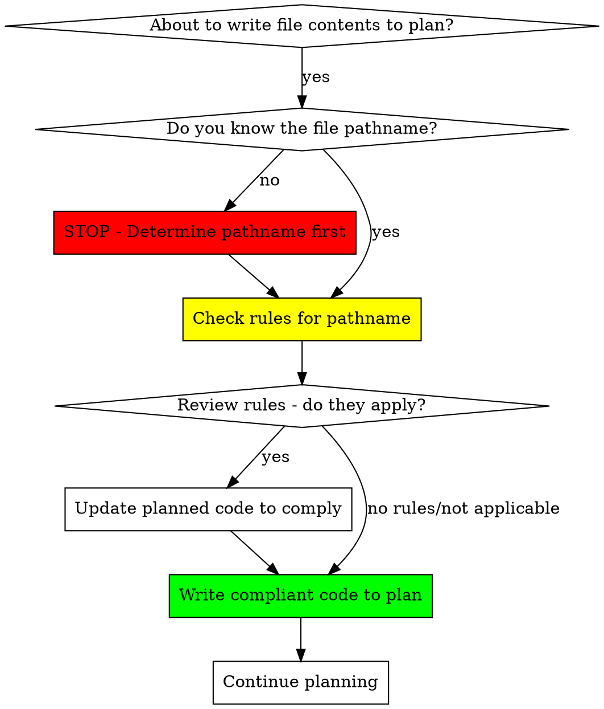

# Managing File Writing Rules

## Overview

Help users interactively manage their file writing rules through conversation. When users mention rules, ask about standards, or want to update conventions, use the rules engine script to retrieve, update, or delete rules.

**Key Principle:** Rules are living documentation. Help users keep them current.

## CRITICAL: Before Writing File Contents to Plan Files

**MANDATORY DISCIPLINE: Check rules BEFORE writing each file's contents to a plan file.**

When writing a plan that includes actual file contents:



**File-by-file process:**
1. **Identify pathname**: `src/components/UserProfile.tsx`
2. **Check rules**: `get-rules --pathname "src/components"`
3. **Review rules**: "Must use named exports only"
4. **Ensure compliance**: Use `export function UserProfile()` not `export default`
5. **Write to plan**: Now the code is correct from the start

**No exceptions:**
- Not "I'll check during implementation"
- Not "This is just example code"
- Not "Plans are drafts"
- Not "Rules apply later"

**Code in plans IS real code. If it violates rules, the plan is wrong.**

## When to Use

Use this skill when user:
- **Asks about standards**: "What rules apply here?", "What are the conventions for this directory?"
- **Mentions outdated rules**: "That rule is old now", "We changed our approach"
- **Wants to see all rules**: "Show me all the TypeScript rules", "List all our standards"
- **Needs to update rules**: "Update that rule to be less strict", "Change the naming convention"
- **Wants to delete rules**: "Remove that old rule", "We don't use that pattern anymore"

### During Planning (MANDATORY)

**This skill is REQUIRED when writing plan files with actual code:**

Every time you write file contents to a plan file, you MUST:
1. Pause before writing the code
2. Identify the exact pathname
3. Check rules for that pathname
4. Ensure the code you're about to write complies
5. Only then write to the plan file

**This happens inline, file-by-file, as you write the plan. Not as a separate review step.**

### When NOT to Use

- Automatically enforcing rules when writing code (use `file-writing-rules` skill instead)
- Validating files for compliance (use `validating-file-writing-rules` skill instead)
- User hasn't explicitly asked about rules or rule management

## Quick Decision Guide

| User Says | Action |
|-----------|--------|
| "What standards apply to src/api?" | Use `get-rules` to show applicable rules |
| "Show me all TypeScript rules" | Use `list-file-types` + `get-rules` with filter |
| "That try-catch rule is outdated" | Use `get-rules` to find it, offer to update/delete |
| "Update rule X to say Y" | Use `set-rule-by-id` to update |
| "Remove that old rule" | Use `get-rules` to identify, then `delete-rule-by-id` |

## Using the Rules Engine

All commands use the bundled `rules-engine.js` script. Access via:

```bash
node ${CLAUDE_PLUGIN_ROOT}/skills/managing-file-writing-rules/rules-engine.js <command> [options]
```

### Available Commands

#### 1. Get Rules (Most Common)

Retrieve rules for a specific pathname:

```bash
# Basic query
node ${CLAUDE_PLUGIN_ROOT}/skills/managing-file-writing-rules/rules-engine.js \
  get-rules --pathname "src/components"

# With file type filter
node ${CLAUDE_PLUGIN_ROOT}/skills/managing-file-writing-rules/rules-engine.js \
  get-rules --pathname "src/api" --file-types "typescript,javascript"

# With max age (recent rules only)
node ${CLAUDE_PLUGIN_ROOT}/skills/managing-file-writing-rules/rules-engine.js \
  get-rules --pathname "src" --max-age "7d"
```

**Returns:** JSON array of rules in precedence order (root → deepest)

#### 2. List File Types

See which file types have rules defined:

```bash
node ${CLAUDE_PLUGIN_ROOT}/skills/managing-file-writing-rules/rules-engine.js \
  list-file-types

# With max age filter
node ${CLAUDE_PLUGIN_ROOT}/skills/managing-file-writing-rules/rules-engine.js \
  list-file-types --max-age "30d"
```

**Returns:** List of file types with rule counts

#### 3. Update Rule

Modify an existing rule's content, file types, or pathname:

```bash
# Update rule content
node ${CLAUDE_PLUGIN_ROOT}/skills/managing-file-writing-rules/rules-engine.js \
  set-rule-by-id --id "src/api:1234567890_abc" --rule "New rule content"

# Update file types
node ${CLAUDE_PLUGIN_ROOT}/skills/managing-file-writing-rules/rules-engine.js \
  set-rule-by-id --id "src/api:1234567890_abc" --file-types "typescript"

# Move to new pathname
node ${CLAUDE_PLUGIN_ROOT}/skills/managing-file-writing-rules/rules-engine.js \
  set-rule-by-id --id "src/api:1234567890_abc" --pathname "src/services"
```

**Important:** Always show user the current rule before updating. Get user confirmation for changes.

#### 4. Delete Rule

Remove a rule by ID:

```bash
node ${CLAUDE_PLUGIN_ROOT}/skills/managing-file-writing-rules/rules-engine.js \
  delete-rule-by-id --id "src/api:1234567890_abc"
```

**Important:** ALWAYS show user the rule content and get explicit confirmation before deleting.

#### 5. Add Rule

Create a new rule (when user explicitly requests it):

```bash
node ${CLAUDE_PLUGIN_ROOT}/skills/managing-file-writing-rules/rules-engine.js \
  add-rule --pathname "src/components" \
  --file-types "typescript,javascript" \
  --rule "All components must use named exports"
```

## Interaction Patterns

### Pattern 1: User Asks About Standards

```
User: "What coding standards apply to src/api?"

You:
1. Run get-rules for that pathname
2. Present results clearly
3. Offer to drill down if needed

Example response:
"I found 3 rules that apply to src/api/:

1. [Root-level] All async operations must include error handling
2. [src/] Use strict TypeScript with no implicit any
3. [src/api/] API responses must use standardized format

Would you like details on any of these?"
```

### Pattern 2: User Mentions Outdated Rule

```
User: "That try-catch rule is outdated - we use error boundaries now"

You:
1. Run get-rules to find the specific rule
2. Show it to user for confirmation
3. Offer to update OR delete
4. Get user input on preferred approach
5. Execute the change
6. Confirm result

Example response:
"Let me find that rule...

Found: Rule ID src/components:1704067200_abc
'All React components must wrap async calls in try-catch blocks'

Since you're using error boundaries now, would you like to:
A) Update it to: 'Use error boundaries for React error handling'
B) Delete it entirely
C) Keep it but mark it as legacy/non-React only

Which would you prefer?"
```

### Pattern 3: User Wants to Browse Rules

```
User: "Show me all TypeScript rules we have"

You:
1. Run list-file-types to confirm TypeScript has rules
2. Run get-rules for each directory with TypeScript rules
3. Present organized by directory

Example response:
"Found TypeScript rules in 3 directories:

**src/ (2 rules)**
- Use strict TypeScript with no implicit any
- Prefer interfaces over types for object shapes

**src/api/ (1 rule)**
- API responses must be typed with interface definitions

**src/components/ (3 rules)**
- All components must use named exports
- Props must be defined with TypeScript interfaces
- Use FC type for functional components

Would you like to update any of these?"
```

## Important Guidelines

### Always Get User Confirmation For:
- **Deletions** - Show rule content, require explicit "yes"
- **Updates** - Show before/after, confirm intent
- **Moves** - Warn that rule ID will change

### Present Results Clearly:
- Group rules by directory (root → deepest)
- Include rule IDs for reference
- Format rule content as blockquotes or code blocks
- Summarize counts ("3 rules found")

### Error Handling:
- If no rules found: "No rules defined for [pathname]"
- If script fails: Show error, suggest checking `.claude/` directory exists
- If rule ID not found: "Rule not found - it may have been deleted. Use get-rules to see current rules."

## Common Mistakes

| Mistake | Fix |
|---------|-----|
| Deleting without confirmation | ALWAYS show rule and get explicit "yes" |
| Updating without showing current content | Show before/after for all updates |
| Using command without checking if rules exist | Always check with get-rules first |
| Not explaining what changed | Summarize changes: "Updated rule X from A to B" |
| Forgetting to mention rule IDs | Include IDs so user can reference later |

## Red Flags: Planning Rationalizations

These thoughts mean STOP - you're about to violate the discipline:

| Rationalization | Reality |
|----------------|---------|
| "I'll check rules during implementation" | Plans with non-compliant code are wrong plans. Check NOW. |
| "This is just example code for the plan" | Code in plans IS real code. It must comply. |
| "Plans are drafts - I'll refine later" | Don't plan code that needs refinement. Plan compliant code. |
| "Rules apply to actual files, not plans" | Plans specify actual files. Rules apply. |
| "I'll do a rules review pass later" | Check inline, file-by-file, as you write. Not later. |
| "The pattern is obvious, I don't need to check" | Assumptions create violations. Check every file. |
| "Planning is about structure, not details" | Export style, error handling, naming ARE structure. Check rules. |

**If you think any of these thoughts while planning: STOP. Check rules for that pathname BEFORE writing code.**

## Real-World Impact

- **Keeps rules current** - Easy to update as practices evolve
- **Removes friction** - Users don't need to learn commands
- **Builds confidence** - Users see rules can be easily modified
- **Encourages adoption** - Interactive management makes rules feel flexible, not rigid

## Example Workflows

### Workflow 1: Updating Rules Interactively

```
User: "We changed our API error handling approach. Can you update that rule?"

You: "Let me check what rules exist for API error handling..."

[Run: get-rules --pathname "src/api"]

You: "Found this rule in src/api/:

Rule ID: src/api:1704067200_xyz
'All API calls must be wrapped in try-catch blocks'

What's your new error handling approach? I can update this rule."

User: "We use a centralized error interceptor now with axios"

You: "Got it. I'll update the rule to:
'API calls use centralized axios error interceptor - no individual try-catch needed'

Should I make this change?"

User: "Yes"

[Run: set-rule-by-id --id "src/api:1704067200_xyz" --rule "API calls use centralized axios error interceptor - no individual try-catch needed"]

You: "✓ Rule updated successfully. The new standard will apply to all future API code in src/api/."
```

### Workflow 2: Checking Rules While Planning (File-by-File)

```
User: "Create a plan for a UserProfile component that calls the /api/user endpoint"

You: "I'll create a plan for this feature. Let me gather context about the codebase..."

[Explores codebase, understands patterns]

You: "Now I'll write the plan. First, I need to write the UserProfile component code.
Before I do that, let me check what rules apply to src/components/..."

[Run: get-rules --pathname "src/components"]

You (reviewing rules found):
- "All React components must use named exports only"
- "Props must be defined with TypeScript interfaces"

You: "Good, I'll make sure the component code uses named exports and typed props.
Now writing to plan file..."

[Writes compliant component code to plan]

You: "Next, I need to write the API endpoint code. Before I do that,
let me check rules for src/api/..."

[Run: get-rules --pathname "src/api"]

You (reviewing rules found):
- "API endpoints must include comprehensive error handling with typed error responses"
- "Use axios interceptors for authentication, not per-request headers"

You: "I'll ensure the endpoint includes proper error handling and uses interceptors.
Now writing to plan file..."

[Writes compliant API code to plan]

You: "Plan complete. All code follows project standards from the start."
```
