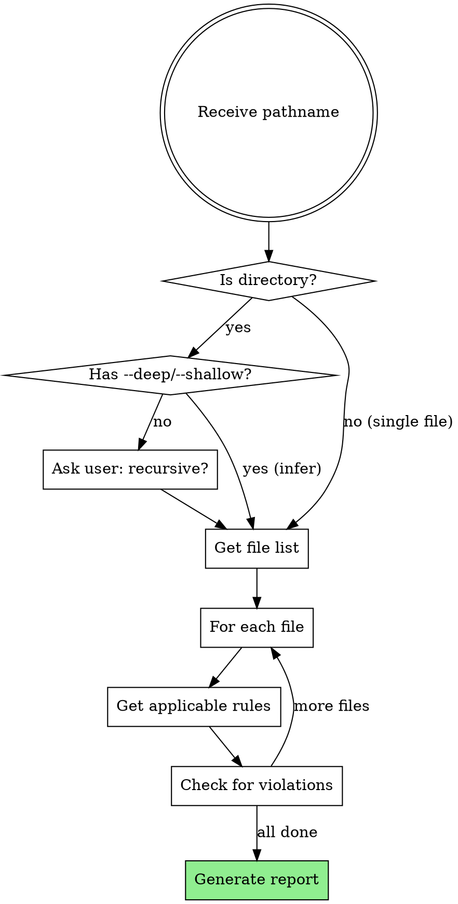

# Validating File Writing Rules

## Overview

**Validate files or directories against project rules to identify violations before code review.**

This skill provides systematic validation that reports which files comply with rules and which violate them, including specific details about each violation.

**Key Principle:** Validation prevents violations. Check compliance before review, not after.

## When to Use

Use this skill when user asks to:
- "Check if [file/directory] follows our rules"
- "Validate [path] against project standards"
- "Audit [directory] for rule violations"
- "See which files violate our conventions"
- "Are there any rule violations in [path]?"

### When NOT to Use

- Enforcing rules before writing (use `enforcing-file-writing-rules` instead)
- Managing existing rules (use `managing-file-writing-rules` instead)
- User is asking to create new rules (help them use `/file-writing-rules:add-rule` command)

## Quick Decision Guide

| User Request | Use This Skill? |
|--------------|-----------------|
| "Check if file X follows rules" | ✅ YES |
| "Validate directory Y" | ✅ YES |
| "Are there violations in Z?" | ✅ YES |
| "I'm about to write file X" | ❌ NO (use enforcing) |
| "Update rule for directory Y" | ❌ NO (use managing) |

## Core Workflow



## Implementation

### Step 1: Parse Input and Determine Scope

**Single File:**
```bash
# User: "Validate src/api/users.ts"
PATHNAME="src/api/users.ts"
IS_FILE=true
FILES=("$PATHNAME")
```

**Directory with Flag:**
```bash
# User: "Validate src/components --deep"
PATHNAME="src/components"
RECURSIVE=true  # inferred from --deep

# User: "Validate src/components --shallow"
PATHNAME="src/components"
RECURSIVE=false  # inferred from --shallow
```

**Directory without Flag:**
```bash
# User: "Validate src/components"
PATHNAME="src/components"
# ASK USER: "Should I check recursively (including subdirectories) or only top-level files?"
# Wait for response, then set RECURSIVE=true or RECURSIVE=false
```

### Step 2: Get File List

**For single file:**
```bash
FILES=("$PATHNAME")
```

**For directory (recursive):**
```bash
# Get all files in directory and subdirectories
FILES=($(find "$PATHNAME" -type f))
```

**For directory (non-recursive):**
```bash
# Get only top-level files
FILES=($(find "$PATHNAME" -maxdepth 1 -type f))
```

### Step 3: Validate Each File

For each file:

```bash
# Extract directory and file type
DIR=$(dirname "$FILEPATH")
EXTENSION="${FILEPATH##*.}"

# Map extension to file type
case "$EXTENSION" in
  ts|tsx) FILE_TYPE="typescript" ;;
  js|jsx) FILE_TYPE="javascript" ;;
  py) FILE_TYPE="python" ;;
  *) FILE_TYPE="" ;;
esac

# Get applicable rules
RULES=$(node ${CLAUDE_PLUGIN_ROOT}/skills/validating-file-writing-rules/rules-engine.js \
  get-rules --pathname "$DIR" --file-types "$FILE_TYPE")

# Check file content against each rule
for RULE in $RULES; do
  # Analyze file for violations
  # Record violations found
done
```

### Step 4: Generate Report

**Report Format:**

```
Validation Report
=================
Checked: 5 files
Compliant: 3 files
Violations: 2 files

Results:
--------

✓ src/api/products.ts
  Status: COMPLIANT
  All applicable rules satisfied

✗ src/api/users.ts
  Status: VIOLATION
  Rule: src/api/ - All network requests must include try-catch error handling
  Issue: Missing try-catch blocks around fetch() calls
  Lines: 15, 23, 42

✓ src/components/Header.tsx
  Status: COMPLIANT
  All applicable rules satisfied

✗ src/components/LoginForm.tsx
  Status: VIOLATION
  Rule: src/components/ - All React components must use named exports
  Issue: Component uses default export only
  Line: 67

✓ src/utils/helpers.ts
  Status: COMPLIANT
  All applicable rules satisfied
```

## Common Validation Patterns

### Pattern 1: Error Handling Validation

**Rule:** "All network requests must include try-catch error handling"

**Check for:**
```typescript
// ❌ VIOLATION
async function fetchData() {
  const response = await fetch('/api/data');
  return response.json();
}

// ✅ COMPLIANT
async function fetchData() {
  try {
    const response = await fetch('/api/data');
    return response.json();
  } catch (error) {
    console.error('Failed to fetch data:', error);
    throw error;
  }
}
```

### Pattern 2: Export Style Validation

**Rule:** "All React components must use named exports"

**Check for:**
```typescript
// ❌ VIOLATION
export default function LoginForm() { ... }

// ✅ COMPLIANT
export function LoginForm() { ... }
// OR
export const LoginForm = () => { ... }
```

### Pattern 3: Type Safety Validation

**Rule:** "Use strict TypeScript with no implicit any"

**Check for:**
```typescript
// ❌ VIOLATION
function process(data) { ... }  // implicit any

// ✅ COMPLIANT
function process(data: ProcessData): Result { ... }
```

### Pattern 4: Copyright Header Validation

**Rule:** "All files must include copyright header"

**Check for:**
```typescript
// ✅ COMPLIANT
// Copyright (c) 2026. All rights reserved.

import { something } from 'somewhere';
```

## Flag Interpretation

| Flag | Meaning | Behavior |
|------|---------|----------|
| `--deep` | Recursive | Check all files in directory and subdirectories |
| `--shallow` | Non-recursive | Check only top-level files in directory |
| (no flag) | Ambiguous | **ASK USER** before proceeding |

**IMPORTANT:** Never assume recursion depth without explicit flag or user confirmation.

## Reporting Guidelines

### Always Include

1. **Summary counts**: Total checked, compliant, violations
2. **Per-file status**: ✓ (compliant) or ✗ (violation)
3. **Violation details**: Which rule, what issue, where (line numbers if possible)
4. **Actionable information**: Enough detail to fix the violation

### Report Structure

```
1. Summary (counts)
2. Detailed results (one entry per file)
3. For violations:
   - Rule that was violated
   - Specific issue found
   - Location (line numbers)
   - Brief recommendation (optional)
```

### Visual Indicators

- ✓ = Compliant (green indicator)
- ✗ = Violation (red indicator)
- Group all violations together for easy scanning

## User Interaction Pattern

### Scenario 1: Single File

```
User: "Check if src/api/users.ts follows our rules"

You:
[Get rules for src/api/ with TypeScript]
[Analyze file content]
[Generate report]

"Validation Result for src/api/users.ts:

✗ VIOLATION FOUND

Rule: src/api/ - All network requests must include try-catch error handling
Issue: Missing try-catch blocks in async functions
Lines: 15, 23, 42

Recommendation: Wrap fetch() calls in try-catch blocks"
```

### Scenario 2: Directory with Flag

```
User: "Validate src/components --deep"

You:
[Infer recursive=true from --deep]
[Get all files in src/components/**/*]
[Validate each file]
[Generate report]

"Validated 12 files in src/components/ (recursive)

Summary:
- 10 compliant
- 2 violations

Violations:
✗ src/components/auth/LoginForm.tsx
  Rule: Named exports required
  Issue: Uses default export

✗ src/components/dashboard/Chart.tsx
  Rule: Named exports required
  Issue: Uses default export"
```

### Scenario 3: Directory without Flag

```
User: "Validate src/components"

You:
"Should I check recursively (including subdirectories) or only top-level files in src/components/?

Options:
- Recursive: Check src/components/**/* (all nested files)
- Top-level only: Check src/components/* (current directory only)"

User: "Recursive"

You:
[Proceed with recursive checking]
[Generate report as in Scenario 2]
```

## Common Mistakes

| Mistake | Fix |
|---------|-----|
| Assuming recursive when not specified | Always ask user if no --deep/--shallow flag |
| Not reporting line numbers | Include specific locations when possible |
| Vague violation descriptions | Be specific: which rule, what issue, where |
| Checking only deepest rules | Apply ALL hierarchical rules (root → deepest) |
| Silent failures | Report if file can't be read or rules can't be loaded |

## Error Handling

**If file doesn't exist:**
```
✗ src/api/missing.ts
  Status: ERROR
  Issue: File not found
```

**If no rules apply:**
```
✓ scripts/helper.js
  Status: COMPLIANT (no rules configured)
  Note: No rules apply to this file
```

**If rules-engine.js fails:**
```
ERROR: Unable to load rules
Suggestion: Check that .claude/file-writing-rules.generated.json exists
```

## Real-World Impact

- **Pre-review validation**: Catch violations before code review
- **Batch compliance checking**: Validate entire directories at once
- **Continuous monitoring**: Regular audits to ensure standards are followed
- **Onboarding tool**: New developers can check their code before submitting
- **Documentation**: Shows exactly which rules apply to which files

## Integration with Other Skills

- **Complements `enforcing-file-writing-rules`**: That skill prevents violations; this detects existing ones
- **Complements `managing-file-writing-rules`**: Validation shows which rules are effective and need updating
- **Complete workflow**: User creates rules → Enforcement (prevent) → Validation (detect) → Management (update)

## Example: Complete Validation

```
User: "Validate src/api/"

You: "Should I check recursively or only top-level files?"

User: "Recursive"

You:
"Validated 8 files in src/api/ (recursive)

Summary:
========
Total: 8 files
Compliant: 6 files
Violations: 2 files

Details:
========

✓ src/api/products.ts - COMPLIANT
✓ src/api/orders.ts - COMPLIANT
✓ src/api/customers.ts - COMPLIANT

✗ src/api/users.ts - VIOLATION
  Rule: src/api/ - All network requests must include try-catch error handling
  Issue: Missing try-catch in fetchUser() and updateUser()
  Lines: 15, 42

✗ src/api/auth.ts - VIOLATION
  Rule: src/api/ - All network requests must include try-catch error handling
  Issue: Missing try-catch in login() function
  Line: 23

✓ src/api/payments.ts - COMPLIANT
✓ src/api/inventory.ts - COMPLIANT
✓ src/api/shipping.ts - COMPLIANT

Action Items:
=============
1. Fix src/api/users.ts - Add try-catch blocks (2 locations)
2. Fix src/api/auth.ts - Add try-catch block (1 location)"
```

## Quick Reference

| Task | Command Pattern |
|------|-----------------|
| Single file | Validate [filepath] |
| Directory (ask) | Validate [directory] → User chooses depth |
| Directory (recursive) | Validate [directory] --deep |
| Directory (top-level) | Validate [directory] --shallow |

**Workflow:**
1. Parse pathname and flags
2. Determine file list (single/directory/recursive)
3. For each file: get rules → check violations
4. Generate structured report with ✓/✗ indicators
